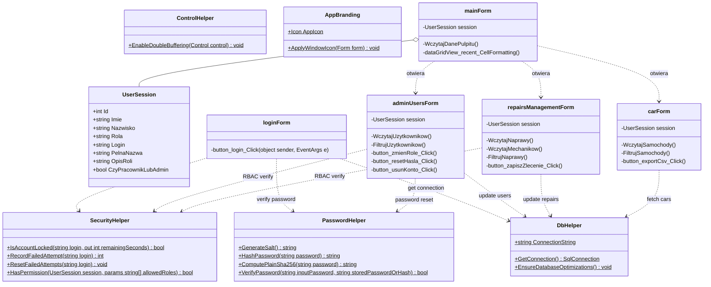
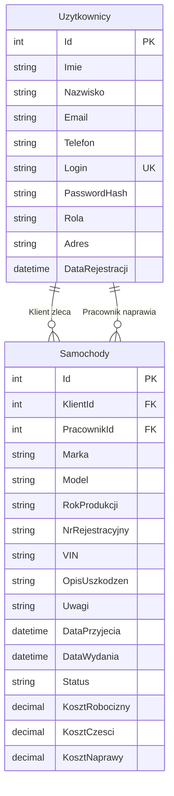

# Warsztat Samochodowy – dokumentacja projektu

Projekt zaawansowanej aplikacji desktopowej do kompleksowej obsługi warsztatu samochodowego (WarsztatDB), zmodernizowany z wykorzystaniem środowiska sztucznej inteligencji **Google Antigravity**.

## Spis treści
1. [Tytuł projektu i skład zespołu](#1-tytuł-projektu-i-skład-zespołu)
2. [Opis problemu, celu i grupy docelowej](#2-opis-problemu-celu-i-grupy-docelowej)
3. [Wymagania funkcjonalne i niefunkcjonalne](#3-wymagania-funkcjonalne-i-niefunkcjonalne)
4. [Zakres podstawowy oraz wykonane funkcje dodatkowe](#4-zakres-podstawowy-oraz-wykonane-funkcje-dodatkowe)
5. [Przypadki użycia](#5-przypadki-użycia)
6. [Makiety najważniejszych ekranów](#6-makiety-najważniejszych-ekranów)
7. [Schemat nawigacji](#7-schemat-nawigacji)
8. [Diagram klas](#8-diagram-klas)
9. [Model bazy danych z opisem encji i relacji](#9-model-bazy-danych-z-opisem-encji-i-relacji)
10. [Opis architektury i struktury pakietów](#10-opis-architektury-i-struktury-pakietów)
11. [Opis wykorzystanych technologii i bibliotek](#11-opis-wykorzystanych-technologii-i-bibliotek)
12. [Podział pracy w zespole i zestawienie wkładu każdego członka](#12-podział-pracy-w-zespole-i-zestawienie-wkładu-każdego-członka)
13. [Harmonogram realizacji](#13-harmonogram-realizacji)
14. [Scenariusze testowe i wyniki testów](#14-scenariusze-testowe-i-wyniki-testów)
15. [Opis wykrytych i poprawionych błędów](#15-opis-wykrytych-i-poprawionych-błędów)
16. [Instrukcja kompilacji i uruchomienia projektu](#16-instrukcja-kompilacji-i-uruchomienia-projektu)
17. [Znane ograniczenia i możliwe kierunki rozwoju](#17-znane-ograniczenia-i-możliwe-kierunki-rozwoju)
18. [Informacje o licencjach wykorzystanych zasobów](#18-informacje-o-licencjach-wykorzystanych-zasobów)

---

## 1. Tytuł projektu i skład zespołu
* **Nazwa projektu:** Warsztat Samochodowy (WarsztatDB)
* **Autor projektu:** Szymon Elendt
* **Wsparcie inżynieryjne i modernizacja:** Google Antigravity (zaawansowany asystent programistyczny AI)

## 2. Opis problemu, celu i grupy docelowej
* **Problem:** Tradycyjna obsługa warsztatu mechanicznego oparta na papierowych zleceniach lub rozproszonych plikach Excel prowadzi do chaosu organizacyjnego, trudności w rozliczaniu kosztów robocizny i części, braku przejrzystości statusów napraw oraz podatności na błędy ludzkie i wycieki danych.
* **Cel:** Wytworzenie bezpiecznego, wysoce wydajnego i ergonomicznego systemu desktopowego wspierającego ewidencję aut, zarządzanie procesem napraw, przypisywanie mechaników, kalkulację kosztów, administrowanie uprawnieniami użytkowników oraz generowanie raportów CSV.
* **Grupa docelowa:** Właściciele warsztatów, kadra kierownicza, mechanicy oraz klienci serwisu pragnący mieć przejrzysty podgląd stanu własnych pojazdów.

## 3. Wymagania funkcjonalne i niefunkcjonalne
* **Wymagania funkcjonalne:**
  * Rejestracja użytkowników z walidacją danych i szyfrowaniem haseł algorytmem SHA-256 z kryptograficzną solą.
  * Uwierzytelnianie z mechanizmem kontroli dostępu opartej na rolach (RBAC: Administrator, Pracownik, Klient).
  * Ochrona przed atakami Brute-Force: automatyczna blokada logowania na 3 minuty po 5 nieudanych próbach.
  * Pulpit nawigacyjny (Dashboard) prezentujący wskaźniki KPI w czasie rzeczywistym oraz podgląd ostatnich pojazdów z kolorystycznym wyróżnieniem statusów.
  * Panel Administratora (`adminUsersForm`): zarządzanie użytkownikami, edycja ról, bezpieczny reset hasła i usuwanie kont z blokadą samousunięcia administratora.
  * Centrum Zarządzania Naprawami (`repairsManagementForm`): pełny cykl życia naprawy (Przyjęty, Diagnostyka, Oczekiwanie na części, W trakcie naprawy, Testy końcowe, Gotowy do odbioru, Wydany), przypisywanie pracowników, kalkulator kosztów (robocizna + części) oraz notatki techniczne.
  * Ewidencja pojazdów (`carForm`): natychmiastowe wyszukiwanie tekstowe (live search), filtrowanie według etapów naprawy, zmiana stanu przez okno `editStatusForm`, usuwanie pojazdów oraz eksport do pliku CSV z kodowaniem UTF-8 z BOM.
  * Profil użytkownika (`userDataForm`): podgląd danych konta oraz edycja adresu e-mail, telefonu i adresu zamieszkania.
* **Wymagania niefunkcjonalne:**
  * Zabezpieczenie przed atakami Timing Attack przy weryfikacji haseł poprzez porównywanie ciągów w stałym czasie (`SlowEquals`).
  * 100% parametryzacja zapytań SQL (`SqlCommand.Parameters`) chroniąca przed SQL Injection.
  * Eliminacja migotania interfejsu (Flicker-Free UI) dzięki podwójnemu buforowaniu (`ControlHelper.EnableDoubleBuffering()`) we wszystkich oknach i tabelach DataGridView.
  * Optymalizacja indeksów bazy danych (`IX_Samochody_Status`, `IX_Samochody_KlientId`, `IX_Uzytkownicy_Rola`) zapewniająca natychmiastową odpowiedź zapytań.
  * Spójna identyfikacja wizualna: paleta Dark Slate (`#0F172A`, `#1E293B`, `#2563EB`), typografia Segoe UI, dedykowany monogram logo `[W|DB]` oraz dynamiczna ikona okna aplikacji.

## 4. Zakres podstawowy oraz wykonane funkcje dodatkowe
* **Zakres podstawowy:** Rejestracja, logowanie, tabela samochodów klienta, formularz dodawania auta, podgląd danych.
* **Wykonane funkcje dodatkowe:**
  * Moduł administracyjny (`adminUsersForm`) z zarządzaniem kontami i uprawnieniami.
  * Moduł warsztatowy (`repairsManagementForm`) do koordynacji etapów napraw i rozliczania kosztów części i robocizny.
  * Ochrona Brute-Force Rate Limiting z 3-minutową blokadą po 5 błędach.
  * Haszowanie haseł z kryptograficzną solą (`SALT:HASH`) z generatorem `RNGCryptoServiceProvider`.
  * Eliminacja migotania tabel za pomocą technologii podwójnego buforowania (`DoubleBuffered`).
  * Kolorowe odznaki statusów (zielony dla gotowych, bursztynowy dla naprawianych, błękitny dla przyjętych, grafitowy dla wydanych).
  * Indeksy wydajnościowe w bazie MS SQL Server.
  * Eksport tabelaryczny do formatu CSV zgodnego z arkuszem kalkulacyjnym Microsoft Excel.
  * Pasek stanu `StatusStrip` informujący o połączeniu z bazą danych i zalogowanym użytkowniku.

## 5. Przypadki użycia
* **Logowanie i autoryzacja:** Użytkownik podaje dane logowania. System sprawdza ewentualną blokadę konta. Po weryfikacji hasha tworzy sesję `UserSession` i dostosowuje widoczne moduły do uprawnień roli.
* **Przeprowadzenie naprawy serwisowej:** Mechanik otwiera Centrum Napraw, przypisuje zlecenie do siebie, ustawia etap (np. "W trakcie naprawy"), wprowadza koszt części i robocizny oraz notatki diagnostyczne.
* **Administracja personelem:** Administrator otwiera Panel Admina, awansuje wybranego klienta na rolę Pracownika lub generuje tymczasowe hasło dla pracownika serwisu.
* **Eksport raportu warsztatowego:** Użytkownik filtruje listę pojazdów do zbieżnych kryteriów i pobiera zestawienie w formacie `.csv`.

## 6. Makiety najważniejszych ekranów
* **Logowanie (`loginForm`):** Nowoczesny układ dzielony (Split Layout, 820x480). Lewa kolumna prezentuje panel marki z sygnetem WarsztatDB, ikonografią motoryzacyjną oraz podsumowaniem kluczowych modułów. Prawa kolumna zawiera wycentrowaną kartę logowania z ciemnymi polami wejściowymi (`#1E293B`), płaskim przyciskiem akcji (`#2563EB`), odnośnikiem do rejestracji, przyciskiem zamknięcia oraz obsługą klawisza Enter.
* **Rejestracja (`registerForm`):** Dwukolumnowy układ formularza (860x550) w ciemnej karcie wizualnej z nagłówkiem `#60A5FA`, pełną walidacją pól, czytelną typografią Segoe UI oraz płaskimi przyciskami zatwierdzenia i powrotu.
* **Pulpit główny (`mainForm`):** 4 interaktywne kafelki KPI z subtelnym obramowaniem, tabela ostatnich zleceń z naprzemiennymi wierszami (`#18202F` i `#1E293B`) oraz powiększonymi wierszami (32px), dolny pasek stanu i dynamiczny pasek nawigacyjny (`FlowLayoutPanel`), który płynnie dostosowuje układ przycisków do roli użytkownika bez luk i kolizji DPI.
* **Panel Administratora (`adminUsersForm`):** Tabela użytkowników z wyszukiwarką live search, filtrami ról, kursorem interaktywnym na przyciskach i narzędziami zmiany roli, resetu hasła oraz bezpiecznego usuwania kont.
* **Centrum Zarządzania Naprawami (`repairsManagementForm`):** Siatka zleceń z kolorystycznymi statusami oraz boczna karta edycyjna z obramowaniem, polami rozbicia kosztów (robocizna + części) i przypisywaniem mechaników.
* **Lista pojazdów (`carForm`):** Wyrównany pasek narzędzi z odstępami 10px, kursory typu Hand, live search, filtr etapów, modalna edycja stanu (`editStatusForm`) oraz eksport do formatu CSV.
* **Mój profil (`userDataForm`):** Nowoczesna karta profilowa z obramowaniem, prezentująca dane konta oraz formularz edycji danych kontaktowych.

## 7. Schemat nawigacji
* `loginForm` -> przejście do `registerForm` lub po autoryzacji do `mainForm`.
* `mainForm`:
  * -> `carForm` (rejestr aut, filtracja, eksport CSV).
  * -> `repairsManagementForm` (dostępne dla ról: Pracownik, Administrator).
  * -> `adminUsersForm` (dostępne wyłącznie dla roli: Administrator).
  * -> `userDataForm` (profil i edycja danych kontaktowych).
  * -> `addCarForm` (rejestracja nowego pojazdu).
  * -> Wylogowanie -> powrót do `loginForm`.

## 8. Diagram klas

## 9. Model bazy danych z opisem encji i relacji
Baza `WarsztatDB` oparta jest na silniku Microsoft SQL Server (LocalDB):
* **Uzytkownicy:** Przechowuje konta klientów, pracowników i administratorów (`Id`, `Login`, `PasswordHash`, `Imie`, `Nazwisko`, `Rola`, `Email`, `Telefon`, `Adres`, `DataRejestracji`).
* **Samochody:** Ewidencja aut powiązana z klientem (`KlientId`) oraz przypisanym pracownikiem (`PracownikId`), z polami technicznymi oraz rozbiciem kosztów (`KosztRobocizny`, `KosztCzesci`, `KosztNaprawy`).

## 10. Opis architektury i struktury pakietów
* **Warstwa prezentacji (UI):** Formularze Windows Forms wyposażone w podwójne buforowanie (`loginForm`, `registerForm`, `mainForm`, `adminUsersForm`, `repairsManagementForm`, `carForm`, `editStatusForm`, `userDataForm`, `addCarForm`).
* **Warstwa logiki i bezpieczeństwa:**
  * `SecurityHelper` (Brute-Force Protection, RBAC).
  * `PasswordHelper` (Salted SHA-256 z porównywaniem w stałym czasie).
  * `UserSession` (kontekst tożsamości użytkownika).
  * `ControlHelper` (DoubleBuffering).
  * `AppBranding` (dynamiczne generowanie ikon i brandingu).
* **Warstwa danych:**
  * `DbHelper` (fabryka połączeń i automatyczna synchronizacja schematu).
  * Microsoft SQL Server LocalDB (`WarsztatDB.mdf`).

## 11. Opis wykorzystanych technologii i bibliotek
* **Język:** C# 7.3
* **Platforma:** .NET Framework 4.8
* **Interfejs użytkownika:** Windows Forms (WinForms)
* **Baza danych:** Microsoft SQL Server LocalDB (`(LocalDB)\MSSQLLocalDB`)
* **Dostawca danych:** `System.Data.SqlClient` (ADO.NET)
* **Kryptografia:** `System.Security.Cryptography.SHA256`, `RNGCryptoServiceProvider`
* **Środowisko:** Visual Studio Community 2019 / 2022
* **Narzędzie wspomagające rozwój:** Google Antigravity

## 12. Podział pracy w zespole i zestawienie wkładu każdego członka
* **Szymon Elendt:** Projekt założeń systemu, model danych SQL, implementacja podstawowych okien i logiki aplikacji, testy funkcjonalne, dokumentacja, poprawki błędów.
* **Google Antigravity:** Usunięcie blokad zasobów, architektura bezpieczeństwa, optymalizacje wydajnościowe oraz dokumentacja.

## 13. Harmonogram realizacji
* **Etap 1:** Projekt schematu bazy danych i wstępnych formularzy.
* **Etap 2:** Implementacja podstawowego logowania i tabeli pojazdów.
* **Etap 3:** Diagnostyka błędów projektanta WinForms i uruchomienie asysty Google Antigravity.
* **Etap 4:** Refaktoryzacja architektury, ujednolicenie Dark Slate UI i metryki pulpitu.
* **Etap 5:** Wdrożenie Panelu Administratora, Centrum Zarządzania Naprawami, ochrony Brute-Force, soli kryptograficznej, indeksów i eksportu CSV.

## 14. Scenariusze testowe i wyniki testów
* **Test 1 (Ochrona Brute-Force):** Wprowadzenie 5 razy błędnego hasła dla użytkownika. Wynik: Sukces – system blokuje możliwość kolejnych prób logowania na 180 sekund.
* **Test 2 (Weryfikacja RBAC):** Próba wywołania panelu administratora przez użytkownika o roli "Klient". Wynik: Sukces – brak przycisku w interfejsie oraz natychmiastowa blokada na poziomie logiki okna.
* **Test 3 (Zarządzanie rolami w Panelu Admina):** Zmiana roli klienta na pracownika oraz próba samousunięcia administratora. Wynik: Sukces – rola zaktualizowana w bazie, próba samousunięcia zablokowana ostrzeżeniem.
* **Test 4 (Podział kosztów w Centrum Napraw):** Wpisanie kosztu robocizny 250 zł i części 400 zł. Wynik: Sukces – automatyczne wyliczenie sumy 650 zł i poprawny zapis w bazie.
* **Test 5 (Eliminacja migotania tabel):** Szybkie przewijanie i filtrowanie tabeli z setkami rekordów. Wynik: Sukces – płynne odświeżanie bez migotania kontrolek dzięki technice `DoubleBuffered`.
* **Test 6 (Eksport CSV z polskimi znakami):** Zapis listy aut do pliku `.csv`. Wynik: Sukces – poprawne kodowanie UTF-8 z BOM, bezbłędne otwarcie w programie Excel.

## 15. Opis wykrytych i poprawionych błędów
* **Błąd 1 (MSB3821 Zone.Identifier):** Blokada plików zasobów pobranych z internetu. Poprawka: Odblokowanie za pomocą polecenia `Unblock-File`.
* **Błąd 2 (Brak konstruktorów bezparametrowych):** Błędy projektanta Visual Studio. Poprawka: Dodanie domyślnych konstruktorów do wszystkich formularzy.
* **Błąd 3 (Podatność na ataki siłowe):** Brak limitu prób logowania. Poprawka: Klasa `SecurityHelper` z blokadą konta po 5 nieudanych próbach.
* **Błąd 4 (Hasła otwartym tekstem i brak soli):** Ryzyko wycieku haseł. Poprawka: Wdrożenie solonego formatu `SALT:HASH` z porównywaniem w stałym czasie.
* **Błąd 5 (Migotanie kontrolek WinForms):** Skakanie wierszy przy przewijaniu tabel. Poprawka: Rozszerzenie `EnableDoubleBuffering()` na wszystkich widokach.
* **Błąd 6 (Luki i kolizje w pasku nawigacji):** Sztywne pozycjonowanie przycisków w menu głównym powodowało powstawanie luk przy ukrywaniu opcji według uprawnień (RBAC) oraz nachodzenie na siebie przy powiększeniu DPI. Poprawka: Zastąpienie stałych współrzędnych dynamicznym kontenerem `FlowLayoutPanel` z dokowaniem od prawej strony.
* **Błąd 7 (Nieergonomiczny interfejs formularzy logowania i rejestracji):** Duża pusta przestrzeń w oknie logowania oraz nieczytelne ciemne napisy na ciemnym tle w formularzu rejestracji. Poprawka: Wdrożenie nowoczesnego układu dzielonego (Split Layout) z panelem marki, ciemnych pól formularzy (`#1E293B`) z obramowaniem oraz kursorów interaktywnych Hand na przyciskach akcji.

## 16. Instrukcja kompilacji i uruchomienia projektu
1. Sklonuj repozytorium na dysk lokalny.
2. Otwórz plik `WarsztatSamochodowy.sln` w środowisku Visual Studio 2019 lub 2022.
3. Upewnij się, że usługa SQL Server Express LocalDB jest zainstalowana.
4. Zbuduj projekt skrótem `Ctrl + Shift + B` (lub menu *Kompilacja -> Kompiluj rozwiązanie*).
5. Uruchom program klawiszem `F5`.

## 17. Znane ograniczenia i możliwe kierunki rozwoju
* **Ograniczenia:** Lokalny plik `LocalDB` ogranicza bazę do jednej maszyny fizycznej.
* **Kierunki rozwoju:**
  * Przeniesienie bazy do chmury (Microsoft Azure SQL).
  * Drukowanie kart napraw i faktur VAT do formatu PDF.
  * Powiadomienia e-mail lub SMS o gotowości pojazdu do odbioru.

## 18. Informacje o licencjach wykorzystanych zasobów
* Projekt udostępniony jest na licencji **MIT**, zezwalającej na swobodne użytkowanie w celach edukacyjnych oraz komercyjnych.

---
---

# Warsztat Samochodowy – instrukcja użytkownika

Podręcznik użytkownika aplikacji desktopowej WarsztatDB dla klientów, mechaników i administratorów serwisu.

## Spis treści
1. [Przeznaczenie aplikacji i jej najważniejsze możliwości](#1-przeznaczenie-aplikacji-i-jej-najważniejsze-możliwości)
2. [Wymagania systemowe](#2-wymagania-systemowe)
3. [Sposób instalacji i uruchomienia](#3-sposób-instalacji-i-uruchomienia)
4. [Opis pierwszego uruchomienia](#4-opis-pierwszego-uruchomienia)
5. [Objaśnienie menu i nawigacji](#5-objaśnienie-menu-i-nawigacji)
6. [Instrukcje wykonania najważniejszych operacji](#6-instrukcje-wykonania-najważniejszych-operacji)
7. [Opis walidacji i komunikatów o błędach](#7-opis-walidacji-i-komunikatów-o-błędach)
8. [Informacje o wymaganych uprawnieniach](#8-informacje-o-wymaganych-uprawnieniach)
9. [Sposób usuwania lub resetowania danych](#9-sposób-usuwania-lub-resetowania-danych)
10. [Rozwiązania typowych problemów](#10-rozwiązania-typowych-problemów)

---

## 1. Przeznaczenie aplikacji i jej najważniejsze możliwości
Aplikacja **WarsztatDB** stanowi kompleksowe środowisko informatyczne dla stacji napraw samochodowych, mechaników oraz ich klientów.

**Główne możliwości systemu:**
* Rejestracja i logowanie z zaawansowanym szyfrowaniem oraz ochroną przed atakami siłowymi (blokada po 5 błędnych próbach).
* Pulpit menedżerski z aktywnymi wskaźnikami liczbowymi oraz podglądem zleceń w kolorystycznych odznakach.
* Panel Administratora (`adminUsersForm`) pozwalający zarządzać kontami, zmieniać role użytkowników, resetować hasła i usuwać konta.
* Centrum Zarządzania Naprawami (`repairsManagementForm`) z koordynacją etapów prac, kalkulatorem robocizny i części oraz przypisywaniem mechaników.
* Ewidencja pojazdów z natychmiastową wyszukiwarką, filtrem etapów oraz eksportem zestawień do formatu CSV zgodnego z programem Excel.
* Zarządzanie własnymi danymi kontaktowymi w module profilu.

## 2. Wymagania systemowe
* **System operacyjny:** Microsoft Windows 10 lub Windows 11 (64-bit).
* **Środowisko uruchomieniowe:** .NET Framework 4.8.
* **Baza danych:** Microsoft SQL Server Express LocalDB.
* **Pamięć RAM:** Minimum 2 GB.
* **Wolna przestrzeń na dysku:** 50 MB.

## 3. Sposób instalacji i uruchomienia
1. Pobierz lub sklonuj repozytorium na dysk komputera.
2. Gotowy plik aplikacji znajduje się w folderze `bin\Debug\WarsztatSamochodowy.exe`.
3. Możesz również otworzyć rozwiązanie w środowisku Visual Studio i nacisnąć klawisz `F5`.

## 4. Opis pierwszego uruchomienia i gotowe konta testowe
Po włączeniu programu pojawia się zmodernizowane okno logowania (`loginForm`). W bazie danych przygotowane są gotowe konta testowe dla każdego poziomu uprawnień (RBAC):

| Rola w systemie | Login | Hasło | Dostępne moduły i uprawnienia |
| :--- | :--- | :--- | :--- |
| **Administrator** | `admin` | `admin123` | Pełny dostęp: Panel Admina (zarządzanie personelem, zmiana ról, reset haseł, usuwanie kont), Centrum Napraw, Ewidencja aut, Eksport CSV. |
| **Pracownik** | `mechanik` | `mechanik123` | Warsztat: Centrum Napraw (zmiana etapów, kalkulacja kosztów części i robocizny, przypisywanie mechaników), Ewidencja aut, Eksport CSV. |
| **Klient** | Rejestracja nowego konta | Dowolne | Pulpit klienta: podgląd stanu własnych zleceń, rejestracja nowego auta (`addCarForm`), edycja własnych danych profilowych (`userDataForm`). |

Możesz również zarejestrować dowolne nowe konto klienta klikając odnośnik *„Nie masz konta? Kliknij tutaj!”* na ekranie logowania.

## 5. Objaśnienie menu i nawigacji
* **Ekran logowania (`loginForm`):** Uwierzytelnianie, automatyczna ochrona przed atakami Brute-Force (blokada po 5 błędach), przejście do formularza rejestracji oraz bezpieczne wyjście.
* **Pulpit główny (`mainForm`):**
  * Kafelki metryk KPI: Łączna liczba aut w bazie, zlecenia w naprawie, pojazdy gotowe do odbioru oraz łączna wartość zleceń.
  * Przycisk *„Pojazdy”*: Rejestr aut z wyszukiwarką live search, filtrem statusów, edycją modalną i eksportem do CSV.
  * Przycisk *„Naprawy”*: Centrum zarządzania naprawami (dostępny dla ról: Pracownik, Administrator).
  * Przycisk *„Panel Admina”*: Zarządzanie użytkownikami i uprawnieniami (dostępny wyłącznie dla roli: Administrator).
  * Przycisk *„+ Nowe auto”*: Rejestracja nowego pojazdu w systemie.
  * Przycisk *„Mój profil”*: Podgląd oraz aktualizacja danych kontaktowych zalogowanego użytkownika.
  * Pasek dolny: Diagnostyka połączenia LocalDB, nazwa zalogowanego użytkownika, aktualna rola oraz znacznik czasu sesji.
* **Centrum Zarządzania Naprawami (`repairsManagementForm`):** Tabela zleceń z podziałem na pojazd, klienta, mechanika i status oraz boczny panel kalkulacji kosztów.
* **Panel Administratora (`adminUsersForm`):** Tabela użytkowników z opcjami awansowania, degradacji ról, resetu haseł i usuwania kont.

## 6. Instrukcje wykonania najważniejszych operacji

### A. Jak zalogować się jako Administrator
1. W oknie logowania w polu *Login* wpisz: `admin`.
2. W polu *Hasło* wpisz: `admin123`.
3. Kliknij przycisk *„Zaloguj się”* (lub wciśnij klawisz `Enter`).
4. Na pulpicie głównym w prawym górnym rogu pojawi się przycisk **„Panel Admina”** oraz przycisk **„Naprawy”**.

### B. Jak nadać rolę Pracownika lub Administratora innemu użytkownikowi
1. Zaloguj się na konto administratora (`admin` / `admin123`).
2. Kliknij przycisk **„Panel Admina”** na górnym pasku nawigacyjnym.
3. W tabeli kont wyszukaj lub zaznacz konto użytkownika, któremu chcesz zmienić uprawnienia.
4. W panelu bocznym w rozwijanej liście *„Ustaw rolę”* wybierz żądaną rolę:
   * **`Pracownik`** – użytkownik zyska dostęp do Centrum Napraw i edycji kosztów serwisowych.
   * **`Administrator`** – użytkownik zyska pełne uprawnienia administratorskie.
5. Kliknij przycisk **„Zapisz rolę”**.
6. Użytkownik po ponownym zalogowaniu uzyska uprawnienia i widok odpowiednich modułów.

### C. Jak zalogować się jako Pracownik / Mechanik
1. W oknie logowania wprowadź: login: `mechanik`, hasło: `mechanik123`.
2. Po zalogowaniu kliknij przycisk **„Naprawy”** na górnym pasku nawigacyjnym.
3. Moduł pozwala na obsługę pełnego cyklu naprawy, przypisywanie zleceń do mechaników oraz rozliczanie kosztów.

### D. Zarządzanie etapem i kosztorysem naprawy
1. Otwórz moduł *„Naprawy”* z poziomu pulpitu głównego.
2. Kliknij interesujące Cię zlecenie w tabeli po lewej stronie.
3. Zmień etap naprawy (np. na *„W trakcie naprawy”* lub *„Gotowy do odbioru”*).
4. Wybierz mechanika odpowiedzialnego za pojazd.
5. Wpisz kwotę robocizny oraz koszt zakupionych części. Program automatycznie wyliczy łączną sumę.
6. Kliknij *„Zapisz zmiany w zleceniu”*.

### E. Resetowanie hasła użytkownika przez Administratora
1. Zaznacz konto użytkownika w Panelu Admina.
2. Naciśnij przycisk *„Resetuj hasło”*.
3. Zatwierdź operację w oknie dialogowym. Nowe hasło zostanie wyświetlone i automatycznie skopiowane do Twojego schowka systemowego.

### F. Eksport danych do pliku CSV
1. Otwórz widok *„Pojazdy”*.
2. W razie potrzeby przefiltruj wyniki wyszukiwarką lub statusem.
3. Kliknij *„Eksportuj CSV”* i wskaż lokalizację pliku na dysku.

## 7. Opis walidacji i komunikatów o błędach
* *„Konto zostało tymczasowo zablokowane z powodu zbyt wielu nieudanych prób logowania.”* – ochrona przed atakiem brute-force (blokada na 3 minuty).
* *„Niepoprawny login lub hasło! Pozostało prób: X”* – informacja o błędnych danych i liczbie pozostałych prób.
* *„Brak uprawnień administracyjnych do tego widoku!”* – odmowa dostępu przy próbie nieautoryzowanego wejścia w moduł chroniony.
* *„Nie możesz usunąć własnego konta, na którym jesteś obecnie zalogowany!”* – zabezpieczenie przed przypadkowym usunięciem konta administratora.
* *„Podaj poprawny koszt robocizny / części.”* – kontrola poprawności formatu kwot numerycznych.

## 8. Informacje o wymaganych uprawnieniach
* **Uprawnienia do plików i katalogu:** Pełny dostęp do zapisu i odczytu w folderze programu celem obsługi bazy `WarsztatDB.mdf`.
* **Uprawnienia procesu:** Prawo do uruchomienia lokalnej instancji silnika bazy danych w ramach konta użytkownika systemu Windows.

## 9. Sposób usuwania lub resetowania danych
* Aby przywrócić bazę do stanu fabrycznego, zamknij program i uruchom skrypt `WarsztatDB_schema.sql` w środowisku SQL Server Management Studio (SSMS) lub w narzędziu Visual Studio SQL Server Object Explorer.

## 10. Rozwiązania typowych problemów
* **Błąd połączenia z bazą danych:** Wpisz w wierszu poleceń (cmd): `sqllocaldb start MSSQLLocalDB`.
* **Odzyskanie zablokowanego konta:** Po odczekaniu 180 sekund blokada wygasa automatycznie. Administrator może również natychmiast odblokować konto resetując hasło w Panelu Admina.
