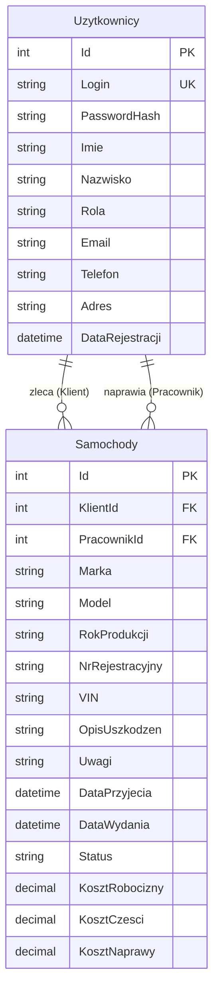
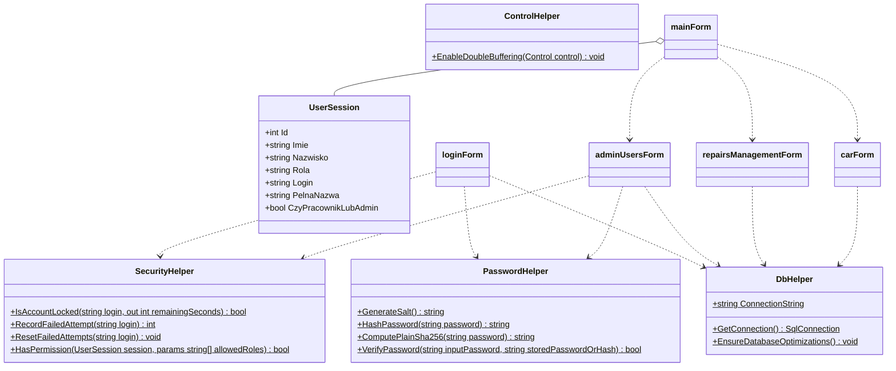

# WarsztatDB – Dokumentacja Projektowa i Instrukcja Obsługi

Desktopowy system wspomagający ewidencję i zarządzanie procesem serwisowym warsztatu samochodowego, zrealizowany w technologii C# .NET Framework (Windows Forms) z bazą Microsoft SQL Server Express LocalDB.

---

## Spis treści
1. [Informacje ogólne](#1-informacje-ogólne)
2. [Cel i zakres funkcjonalny](#2-cel-i-zakres-funkcjonalny)
3. [Wymagania systemowe i architektura](#3-wymagania-systemowe-i-architektura)
4. [Model danych (Baza SQL)](#4-model-danych-baza-sql)
5. [Diagram klas i struktura kodu](#5-diagram-klas-i-struktura-kodu)
6. [Mechanizmy bezpieczeństwa](#6-mechanizmy-bezpieczeństwa)
7. [Scenariusze testowe](#7-scenariusze-testowe)
8. [Instrukcja kompilacji i uruchomienia](#8-instrukcja-kompilacji-i-uruchomienia)
9. [Instrukcja użytkownika (Konta testowe i obsługa)](#9-instrukcja-użytkownika-konta-testowe-i-obsługa)
10. [Diagnostyka i rozwiązywanie problemów](#10-diagnostyka-i-rozwiązywanie-problemów)

---

## 1. Informacje ogólne
* **Nazwa projektu:** Warsztat Samochodowy (WarsztatDB)
* **Autor:** Szymon Elendt
* **Platforma docelowa:** .NET Framework 4.8
* **Język programowania:** C# 7.3
* **Licencja:** MIT

---

## 2. Cel i zakres funkcjonalny

### Cel
System ma na celu zastąpienie tradycyjnej dokumentacji papierowej i rozproszonych arkuszy kalkulacyjnych dedykowanym narzędziem desktopowym, zapewniającym spójną ewidencję aut, przejrzysty podział kosztów serwisowych oraz kontrolę uprawnień pracowników.

### Główne moduły
* **Panel nawigacyjny (Dashboard - `mainForm`):** Prezentacja kluczowych wskaźników serwisowych (liczba aut w bazie, auta w trakcie naprawy, auta gotowe, łączna wartość zleceń) oraz lista ostatnich wpisów ze statusem.
* **Moduł warsztatowy (`repairsManagementForm`):** Pełny cykl naprawy, przypisywanie mechaników, kalkulacja sumaryczna (koszt robocizny + koszt części) oraz notatki techniczne.
* **Rejestr pojazdów (`carForm`):** Wyszukiwarka na bieżąco (live search), filtrowanie według etapów prac, edycja statusu (`editStatusForm`) oraz eksport tabelaryczny do CSV z kodowaniem UTF-8 z BOM.
* **Panel administratora (`adminUsersForm`):** Zarządzanie kontami użytkowników, zmiana ról (Klient / Pracownik / Administrator), generowanie i reset haseł oraz bezpieczne usuwanie użytkowników.
* **Profil konta (`userDataForm`):** Wgląd w dane logowania oraz edycja informacji teleadresowych (e-mail, telefon, adres zamieszkania).

---

## 3. Wymagania systemowe i architektura

### Wymagania systemowe
* **System operacyjny:** Windows 10 lub Windows 11 (64-bit).
* **Środowisko:** .NET Framework 4.8.
* **Silnik bazy danych:** Microsoft SQL Server Express LocalDB (`(LocalDB)\MSSQLLocalDB`).
* **Pamięć RAM:** min. 2 GB.
* **Miejsce na dysku:** ok. 50 MB wolnej przestrzeni.

### Architektura aplikacji
Aplikacja została zbudowana w architekturze warstwowej opartej o kontrolki Windows Forms i bezpośrednią komunikację ADO.NET:
* **Warstwa interfejsu (UI):** Formularze systemu zoptymalizowane pod kątem eliminacji migotania (`ControlHelper.EnableDoubleBuffering`) oraz dynamicznej nawigacji (`FlowLayoutPanel`).
* **Warstwa logiki i bezpieczeństwa:**
  * `SecurityHelper`: obsługa limitowania prób logowania (Rate Limiting) oraz weryfikacja ról (RBAC).
  * `PasswordHelper`: generowanie soli kryptograficznej, haszowanie SHA-256 i stałoczasowe porównywanie ciągów (`SlowEquals`).
  * `UserSession`: singleton sesji przechowujący kontekst zalogowanego użytkownika.
  * `AppBranding`: dynamiczna oprawa graficzna i ikony interfejsu.
* **Warstwa dostępu do danych (DAL):**
  * `DbHelper`: fabryka połączeń `SqlConnection` do lokalnego pliku `WarsztatDB.mdf`, automatyczna weryfikacja i optymalizacja indeksów bazy.

---

## 4. Model danych (Baza SQL)

Baza `WarsztatDB` przechowuje relację między właścicielami pojazdów (Klienci), personelem wykonującym naprawy (Pracownicy) a samymi pojazdami.


```mermaid
erDiagram
    Uzytkownicy ||--o{ Samochody : "zleca (Klient)"
    Uzytkownicy ||--o{ Samochody : "naprawia (Pracownik)"
    
    Uzytkownicy {
        int Id PK
        string Login UK
        string PasswordHash
        string Imie
        string Nazwisko
        string Rola
        string Email
        string Telefon
        string Adres
        datetime DataRejestracji
    }

    Samochody {
        int Id PK
        int KlientId FK
        int PracownikId FK
        string Marka
        string Model
        string RokProdukcji
        string NrRejestracyjny
        string VIN
        string OpisUszkodzen
        string Uwagi
        datetime DataPrzyjecia
        datetime DataWydania
        string Status
        decimal KosztRobocizny
        decimal KosztCzesci
        decimal KosztNaprawy
    }
```

---

## 5. Diagram klas i struktura kodu


```mermaid
classDiagram
    class DbHelper {
        +string ConnectionString$
        +GetConnection()$ SqlConnection
        +EnsureDatabaseOptimizations()$ void
    }

    class PasswordHelper {
        +GenerateSalt()$ string
        +HashPassword(string password)$ string
        +ComputePlainSha256(string password)$ string
        +VerifyPassword(string inputPassword, string storedPasswordOrHash)$ bool
    }

    class SecurityHelper {
        +IsAccountLocked(string login, out int remainingSeconds)$ bool
        +RecordFailedAttempt(string login)$ int
        +ResetFailedAttempts(string login)$ void
        +HasPermission(UserSession session, params string[] allowedRoles)$ bool
    }

    class ControlHelper {
        +EnableDoubleBuffering(Control control)$ void
    }

    class UserSession {
        +int Id
        +string Imie
        +string Nazwisko
        +string Rola
        +string Login
        +string PelnaNazwa
        +bool CzyPracownikLubAdmin
    }

    class loginForm
    class mainForm
    class adminUsersForm
    class repairsManagementForm
    class carForm

    loginForm ..> SecurityHelper
    loginForm ..> PasswordHelper
    loginForm ..> DbHelper
    mainForm o-- UserSession
    mainForm ..> adminUsersForm
    mainForm ..> repairsManagementForm
    mainForm ..> carForm
    adminUsersForm ..> SecurityHelper
    adminUsersForm ..> PasswordHelper
    adminUsersForm ..> DbHelper
    repairsManagementForm ..> DbHelper
    carForm ..> DbHelper
```

---

## 6. Mechanizmy bezpieczeństwa

1. **Ochrona przed atakami siłowymi (Brute-Force):** Po 5 nieudanych próbach logowania na dany login, konto zostaje tymczasowo zablokowane na 180 sekund (obsługiwane w pamięci przez `SecurityHelper`).
2. **Kryptograficzne zabezpieczenie haseł:** Hasła przechowywane są w formacie `SALT:HASH` przy użyciu generatora liczb losowych `RNGCryptoServiceProvider` oraz skrótu SHA-256. Weryfikacja hasha odbywa się w stałym czasie (ochrona przed atakami typu Timing Attack).
3. **Ochrona przed SQL Injection:** Wszystkie operacje na bazie danych wykonywane są wyłącznie za pomocą zapytań parametryzowanych (`SqlCommand.Parameters`).
4. **Kontrola dostępu (RBAC):** Elementy interfejsu oraz metody formularzy sprawdzają uprawnienia sesji (`UserSession.Rola`). Próba nieautoryzowanego otwarcia widoku pracownika lub administratora skutkuje natychmiastową blokadą logiczną.

---

## 7. Scenariusze testowe

| Nr | Zakres testu | Działanie testowe | Oczekiwany wynik |
| :--- | :--- | :--- | :--- |
| **T1** | Brute-force | 5-krotne wpisanie błędnego hasła | Blokada logowania na 180 s z licznikiem czasu |
| **T2** | Uprawnienia RBAC | Zalogowanie na konto Klienta | Przyciski modułu administracyjnego i napraw są niedostępne |
| **T3** | Samousunięcie admina | Próba usunięcia własnego konta w Panelu Admina | Blokada operacji z komunikatem ostrzegawczym |
| **T4** | Kalkulator napraw | Wpisanie kosztu robocizny i części | Automatyczne zsumowanie i zapis w kolumnie `KosztNaprawy` |
| **T5** | Wydajność tabeli | Szybkie przewijanie listy pojazdów | Brak migotania wierszy dzięki `EnableDoubleBuffering` |
| **T6** | Raport CSV | Eksport tabeli aut z polskimi znakami diakrytycznymi | Poprawne kodowanie UTF-8 z BOM, poprawne otwarcie w Excelu |

---

## 8. Instrukcja kompilacji i uruchomienia

### Wymagania wstępne
* Zainstalowane środowisko **Visual Studio 2019 lub 2022** (z obciążeniem *.NET desktop development*).
* Zainstalowany silnik **SQL Server Express LocalDB**.

### Kroki uruchomienia
1. Sklonuj repozytorium:
   ```bash
   git clone [https://github.com/szymekele/WarsztatSamochodowy.git](https://github.com/szymekele/WarsztatSamochodowy.git)
   ```
2. Otwórz plik rozwiązania `WarsztatSamochodowy.sln` w Visual Studio.
3. W razie problemu z połączeniem z bazą upewnij się, że usługa LocalDB jest uruchomiona:
   ```cmd
   sqllocaldb start MSSQLLocalDB
   ```
4. Zbuduj projekt skrótem `Ctrl + Shift + B`.
5. Uruchom program za pomocą klawisza `F5`.

---

## 9. Instrukcja użytkownika

### Domyślne konta demonstracyjne

| Poziom uprawnień | Login | Hasło | Zakres dostępu |
| :--- | :--- | :--- | :--- |
| **Administrator** | `admin` | `admin123` | Pełny: Panel Admina, Centrum Napraw, Ewidencja, Raporty CSV. |
| **Pracownik** | `mechanik` | `mechanik123` | Serwis: Centrum Napraw, Kalkulacja kosztów, Ewidencja pojazdów. |
| **Klient** | *Dowolne zarejestrowane* | *Własne* | Podgląd własnych aut, rejestracja nowego pojazdu, edycja profilu. |

### Kluczowe operacje w programie

#### Logowanie
* Wprowadź login i hasło w formularzu `loginForm`, zatwierdź przyciskiem **Zaloguj się** lub klawiszem `Enter`.

#### Dodanie pojazdu
* Wybierz **+ Nowe auto** w menu górnym. Wprowadź markę, model, rok produkcji, numer rejestracyjny i opis usterki, po czym zatwierdź formularz.

#### Zarządzanie statusem i kosztorysem naprawy (Pracownik / Admin)
1. Otwórz moduł **Naprawy**.
2. Wybierz zlecenie z listy po lewej stronie.
3. Zaktualizuj etap naprawy (np. *W trakcie naprawy*, *Gotowy do odbioru*).
4. Przypisz pracownika odpowiedzialnego za realizację.
5. Uzupełnij kwoty robocizny i części – łączny koszt przeliczy się automatycznie.
6. Zatwierdź przyciskiem **Zapisz zmiany w zleceniu**.

#### Nadawanie uprawnień i reset haseł (Administrator)
1. Przejdź do modułu **Panel Admina**.
2. Zaznacz konto użytkownika w tabeli.
3. W panelu bocznym wskaż nową rolę i kliknij **Zapisz rolę**.
4. W przypadku resetu hasła kliknij **Resetuj hasło** – nowe hasło zostanie wyświetlone i skopiowane do schowka.

#### Eksport danych
* W oknie **Pojazdy** kliknij **Eksportuj CSV**, aby zapisać aktualnie wyświetlaną listę do pliku arkusza kalkulacyjnego.

---

## 10. Diagnostyka i rozwiązywanie problemów

| Objaw / Komunikat | Możliwa przyczyna | Rozwiązanie |
| :--- | :--- | :--- |
| Błąd połączenia z bazą danych przy starcie | Zatrzymana instancja MSSQLLocalDB | Wpisz w terminalu: `sqllocaldb start MSSQLLocalDB` |
| Komunikat o blokadzie logowania na 3 minuty | Przekroczono limit 5 nieudanych prób logowania | Odczekaj 180 sekund lub zresetuj hasło z konta administratora |
| Błąd kompilacji MSB3821 dotyczący plików `.resx` | Pliki zablokowane przez Windows po pobraniu ZIP | W PowerShell w folderze projektu wykonaj: `dir -Recurse \| Unblock-File` |
| Potrzeba przywrócenia fabrycznego stanu bazy | Zmodyfikowane lub uszkodzone dane testowe | Wykonaj skrypt `WarsztatDB_schema.sql` w Visual Studio (SQL Server Object Explorer) |
